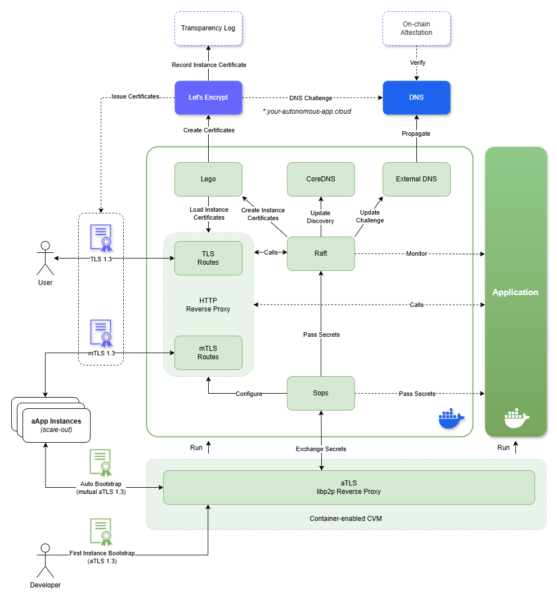

# aApp Toolkit

The **aApp Toolkit** is a comprehensive set of tools designed to simplify building, deploying, and running applications on **Trusted Execution Environment (TEE)**-enabled hardware. Whether you're packaging your application, setting up deployment, or integrating essential services, the toolkit jumpstarts your journey into secure, TEE-based application development.

[](https://discord.gg/fWwMSZdBF2)

## 🚀 Features

- **Container-based Application Packaging**  
  Easily containerize your application for deployment in TEE environments.

- **TEE-Enabled Hardware Deployment**  
  Includes pre-configured base VM images for supported hardware platforms (Intel TDX and AMD SEV-SNP), ensuring a seamless setup process.

- **Composable Deployment Model**  
  Deploy your application in a single container-capable CVM or compose it within complex orchestration setups—ranging from confidential containers to confidential kubernetes clusters.

- **Confidential Networking**  
  Enable your application instances to form confidential networks for high availability, load balancing, and more.

- **Platform-Agnostic Services**  
  Build applications in any language or framework. The toolkit’s services follow the sidecar pattern and include:
  - **Remote Attestation**: Simplify verifying the integrity and authenticity of application instances.
  - **Reverse Proxy (Attestation-Aware)**: Manage ingress and egress traffic securely.
  - **Service Discovery**: Enable dynamic discovery of services across your confidential application cloud.
  - **Additional Tools**: Explore more features tailored for secure and efficient TEE application development.

## 🎯 Why Use aApp Toolkit?

Building applications for TEE-enabled hardware comes with unique challenges like secure packaging, attestation, and handling high availability. The **aApp Toolkit** abstracts these complexities, providing developers with streamlined, ready-to-use solutions. Focus on creating great applications without reinventing the wheel.

## 🛠️ Getting Started

Follow the steps below to start using the **aApp Toolkit**.

### Prerequisites

Ensure the following tools are installed:
- **Terraform**: [Install Terraform](https://developer.hashicorp.com/terraform/install)  
- **Mozilla SOPS**: [Install SOPS](https://github.com/getsops/sops/releases)

### Containerize Your Application

The toolkit includes base container images to simplify application containerization. Choose from pre-built images or create a tailored one.

### Deploy Your Application

In the `terraform` folder, find examples for deploying container-enabled CVMs using public cloud confidential offerings like GCP and Azure.

### Bootstrap Your Application

Use the `aapp-toolkit-cli` to connect to deployed application instance, perform remote attestation, and bootstrap them with your aApp manifest created using `sops`:

```yaml
apiVersion: alpha.aapp-toolkit.io/v1
kind: Application
spec:
  dns:
    zone: '*.your-autonomous-app.cloud'
    provider: 
      name: cloudflare
      env:
        - name: CF_API_KEY
          value: ENC[AES256_GCM,data:p673w==,iv:YY=,aad:UQ=,tag:A=]
        - name: CF_API_EMAIL
          value: ENC[AES256_GCM,data:CwE4O1s=,iv:2k=,aad:o=,tag:w==]
  ingress:
     rules:
      - http:
          paths:
          - path: "/web"
            backend:
              service:
                port:
                  number: 8080
  mtlsIngress:
     rules:
      - http:
          paths:
          - path: "/api"
            backend:
              service:
                port:
                  number: 8080
sops:
# Negotiated SOPS metadata
```

### Test Your Application

Access the public ingress endpoint specified in the manifest to establish a secure connection to your aApp.

### Scale Out Your Application (Optional)

Deploy additional container-enabled CVMs using Terraform. Observe P2P-based discovery and the automatic bootstrapping of new aApp instances.

## 🧰 Under the Hood

The **aApp Toolkit** follows the sidecar design pattern. Services are delivered using proxies and operating system environment primitives (e.g., environment variables, `stdin`, and `stdout`). Built on leading open-source projects from the cloud-native ecosystem configured and extended for supporting confidential computing scenarios.

### High-Level Architecture



### Core Concepts

- **DNS-Based Attested Service Discovery**  
  aApp instances are discovered both publicly and privately via DNS. During the initial bootstrapping, the app takes ownership of a DNS zone used for public and private communications.

- **P2P Bootstrapping**  
  The first instance is bootstrapped by the developer upon remote attestation. Subsequent instances are self-bootstrapped after mutual attestation. This process configures proxies and seeds initial secrets, ensuring traceability in the certificate-issuing process via a public transparency log.

- **High Availability**  
  Multiple aApp instances form a network, actively monitoring application state and reporting to service discovery components.

## 🤝 Contributing

This project is in its early stages. Significant contributions should be discussed with the team beforehand to ensure alignment with project goals. Join the conversation on [Discord](https://discord.gg/fWwMSZdBF2) or open/reply to issues to propose your ideas.

## 📄 License

This project is licensed under the [MIT License](LICENSE).